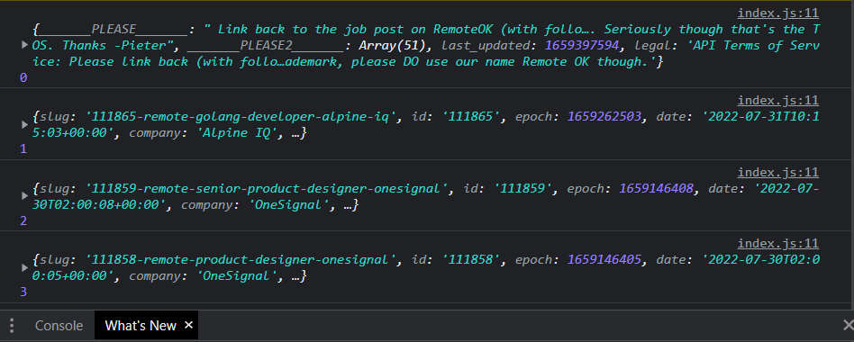
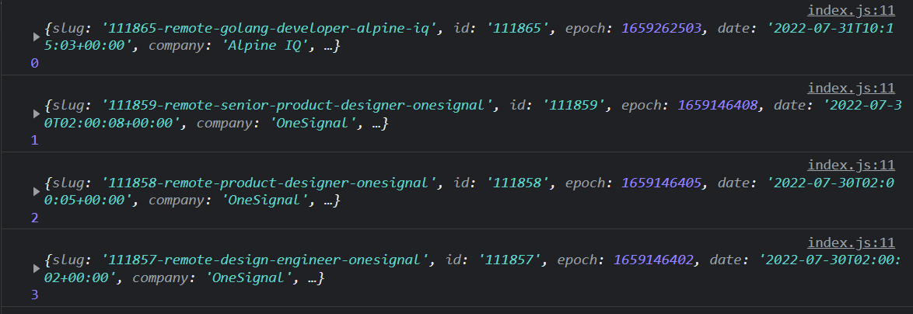

# remote-job-board

A developer that I have been following a long time and admire is Indie Solopreneur [Pieter Levels](https://twitter.com/levelsio) who is the creator of [NomadList](https://nomadlist.com/) and [Remote Ok](https://remoteok.com/).

In this project, I am recreating a simple remote job board using Remote Ok's [API](https://remoteok.com/api)

Since I have been applying for a Software Developer job, looking at job boards peaked my interest to recreate and understand how it works.

I am also doing this project to solidify and bringing my learning with HTML, CSS and Vanilla JavaScript all together.

## How It's Made:

**Tech used:** HTML, CSS, JavaScript

### Requesting Data from servers

I used an AJAX Request to the RemoteOk API https://remoteok.com/api

I used the traditional way to request data from a server using the XMLHttpRequest.

_Why use XMLHttpRequest instead of Fetch?_

I understand that Fetch is better to use but I wanted to practice using XMLHttpRequest since that is natively suppoerted in older browser versions.

Later on, I will replace it with Fetch for understanding modern practice.

### Turning data to objects

Instead of data will be displayed on the body/innerHTML, I use the JSON.parse() method to turn all the data/string response to a JS object and assign it to a variable called data.

`const data = JSON.parse(xhttp.responseText)`

### Loop through each array

To loop over each row/array, I used the forEach() method.

` data.forEach(function (row, index) { console.log(row, index); });`

**Obstacle:** I don't want the first row to render.

**solution:**
Using the [slice()](https://developer.mozilla.org/en-US/docs/Web/JavaScript/Reference/Global_Objects/Array/slice) method.

`data.slice(1).forEach(function (row, index) { console.log(row, index); });`

The slice() method returns a copy of a portion of an array. Since `end` is not included, slice(1) cuts the `index 0` row and starts from index 1 to end.

