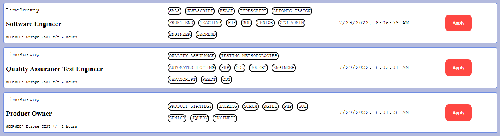
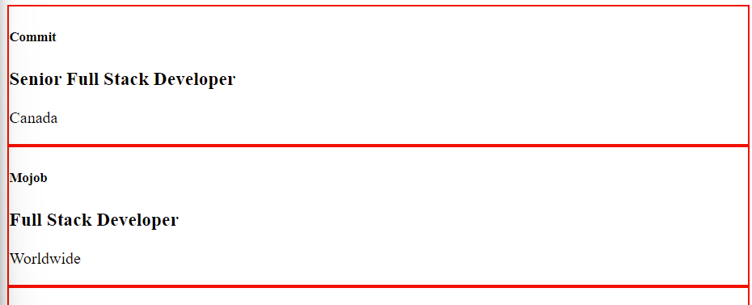
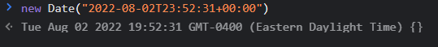

# remote-job-board

In this project, I am recreating a simple remote job board using Remote Ok's [API](https://remoteok.com/api)

A developer that I have been following a long time and admire is Indie Solopreneur [Pieter Levels](https://twitter.com/levelsio) who is the creator of [NomadList](https://nomadlist.com/) and [Remote Ok](https://remoteok.com/).

Since I have been applying for a Software Developer job, looking at job boards peaked my interest to recreate and understand how it works.

I am also doing this project to solidify and bringing my learning with HTML, CSS and Vanilla JavaScript all together.

**Link to project** https://brianbud.github.io/remote-job-board/



## How It's Made:

**Tech used:** HTML, CSS, JavaScript

### Requesting Data from servers

I used an AJAX Request to the RemoteOk API https://remoteok.com/api

I used the traditional way to request data from a server using the XMLHttpRequest.

_Why use XMLHttpRequest instead of Fetch?_

I understand that Fetch is better to use but I wanted to practice using XMLHttpRequest since that is natively suppoerted in older browser versions.

Later on, I will replace it with Fetch for understanding modern practice.

### Turning data to objects

Instead of data will be displayed on the body/innerHTML, I use the JSON.parse() method to turn all the data/string response to a JS object and assign it to a variable called data.

`const data = JSON.parse(xhttp.responseText)`

### Loop through each array

To loop over each row/array, I used the forEach() method.

` data.forEach(function (row, index) { console.log(row, index); });`

**Obstacle:** I don't want the first row to render.


**solution:**
Using the [slice()](https://developer.mozilla.org/en-US/docs/Web/JavaScript/Reference/Global_Objects/Array/slice) method.

`data.slice(1).forEach(function (row, index) { console.log(row, index); });`

The slice() method returns a copy of a portion of an array. Since `end` is not included, slice(1) cuts the `index 0` row and starts from index 1 to end.


### Create Div element to display main data

`const rowDiv = document.createElement('div');` creates div
and I fill the div with the object property for informations needed:

```javascript
rowDiv.innerHTML = `
      <h5>${row.company}</h5>
      <h3>${row.position}</h3>
      <p>${row.location}</p>
      `;
```

**Why use `innerHTML` instead of `.textContent`?**

I set the innerHTML to have More HTML elements by creating it as a string of HTML elements instead of using multiple `createElement` method for each element.

To display the data on the page I used the `appendChild` method.

`const container = document.getElementById('container');` does a query selector for the body container and ` container.appendChild(rowDiv);` appends the data to the webpage with the rows with the info for Company name, job title and location.

eg:


### Basic CSS Styling

This website layout uses Flexbox.

I created new divs for left and mid section and using `display: flex`, it will by default be in a row in which I can now add tags for the mid-section.

### Using `map()` and `join()` method to display tags

For the mid-section, I used `.map()` method to add every element in a `<span>`

The result returns all the elements with a commas that separate them.


to get rid of the commas I used the `.join('')`.


ps. for now, ignore all the `border: 2px solid red;`, those are for visual guides.

**Obstacle:** tags outside the container


I placed the tags in a `<span>` so I believe this issue occured because it's in-line elements. I replaced it with `<div>` which are block elements to avoid overflowing from the container.

since `div` is a block element and stacks on each other, to make it look like the final product, I used `display: flex` , `flex-wrap:wrap` and `align-items: center`.

### Button section


The buttons opens up a new tab to the actual job posting in Remote OK's website thanks to adding the object property of the url from the API.

Regarding styling, I started making a habit to always use `cursor: pointer` and change in opacity for give the user a feedback in `:hover` state and make it look more clickable.

The background-color is the same as in the original website which I got by inspecting it.

### Making Date posted more readable

In the API, the job date posted is in a confusing format that looks like this: _"2022-08-02T23:52:31+00:00"_

Javascript has a built-in class called `new Date()` which converts this `new Date("2022-08-02T23:52:31+00:00" )` into a date object that looks like this: _Tue Aug 02 2022 19:52:31 GMT-0400 (Eastern Daylight Time)_



However this format still looked complicated and I used `toLocaleString()` method that made it more readable.


## Lessons Learned:

- `JSON.parse()` and `JSON.stringify()`
- working with XMLHttpRequest instead of Fetch
- Looping with `forEach()`
- using JS `new Date()` and `.toLocaleString()` for time
- overall I learned to Google better and be patient to find the right solution.

For the future, I would like to add more features and build more upon this especially to make it look better.

Thank you for reading this.
